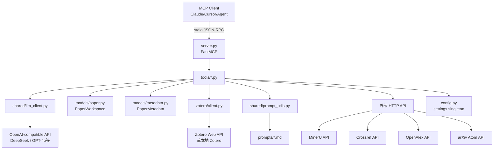

# 项目总览（OVERVIEW.md）

> **职责**：用一份文档让人和 Agent 一眼看懂这个项目是什么、要解决什么问题、整体架构和目录结构。
> **最后更新**：2026-03-09

---

## 一句话描述

**fro-wang-academic-tools-mcp** 是一个统一的**学术论文处理 MCP Server**，通过 FastMCP 以 stdio 协议暴露 19 个工具，供 Claude Desktop / Cursor / 任意 MCP-compatible Agent 直接调用。

## 项目目标 / 研究问题

- **目标1**：提供一站式论文处理能力（OCR、元数据提取、结构分析、翻译、摘要、重命名）
- **目标2**：支持 arXiv 搜索与下载
- **目标3**：集成本地 Zotero 只读文献库访问（9 个工具）

## 主能力链路

```
PDF  →[ocr_paper]→  full.md
                →[extract_metadata]→  metadata.json  （LLM + Crossref + OpenAlex）
                →[extract_sections]→  *_structure.json
                →[translate_paper]→   *_translated.md （并发翻译）
                →[generate_summary]→  summary_report.md
                →[rename_paper_folder]→  目录按 Authors-Venue-Year-Title 规范重命名
```

或一次调用 `process_paper` 完成所有步骤，支持断点续跑。

## 系统架构



### 各层说明

| 层 | 职责 | 关键文件 |
|----|------|----------|
| **入口层** | 启动 MCP 服务，注册所有工具 | `server.py`, `__main__.py` |
| **工具层** | 每个 `.py` 暴露一个 `register(mcp)` 函数 | `tools/*.py` |
| **编排层** | `pipeline.py` 串联所有步骤 | `tools/pipeline.py` |
| **基础设施层** | 配置单例、LLM 客户端、Prompt 加载 | `config.py`, `shared/`, `models/` |
| **外部连接层** | Zotero pyzotero 包装、Prompt 模板 | `zotero/`, `prompts/` |

## 目录结构说明

| 目录 | 作用 |
|------|------|
| `src/academic_tools/` | 主源码目录 |
| `src/academic_tools/tools/` | 8 个论文处理工具 + pipeline + arXiv + Zotero |
| `src/academic_tools/shared/` | LLM 客户端、Prompt 工具、文本处理函数 |
| `src/academic_tools/models/` | PaperWorkspace、PaperMetadata 数据模型 |
| `src/academic_tools/zotero/` | Zotero 连接层 |
| `src/academic_tools/prompts/` | LLM Prompt 模板文件 |
| `docs/` | 项目文档（6 个动态文档） |

## 技术栈

- **Python ≥ 3.11**（项目要求 `requires-python = ">=3.11"`）
- **核心依赖**：
  - `fastmcp` — MCP Server 框架
  - `openai` — LLM 调用
  - `pyzotero` — Zotero API 客户端
  - `fitz` (PyMuPDF) — PDF 处理
- **外部 API**：
  - MinerU (`mineru.net/api/v4`) — PDF OCR
  - DeepSeek / OpenAI-compatible — LLM
  - Crossref / OpenAlex — 元数据富化
  - arXiv — 论文搜索
  - Zotero — 文献库管理

---

> 建议每次项目大变动后同步更新本文件。
