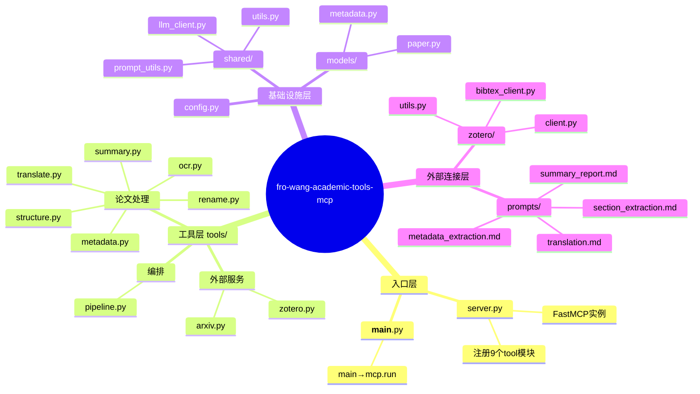
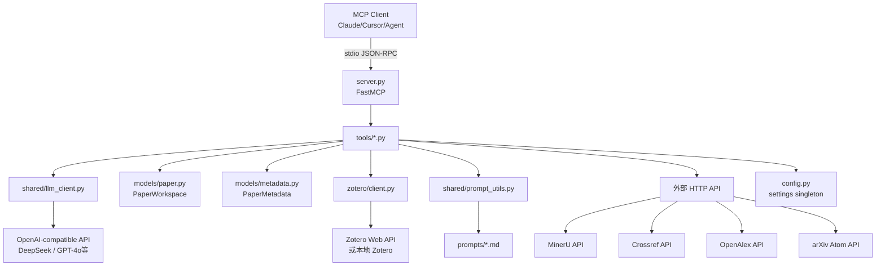
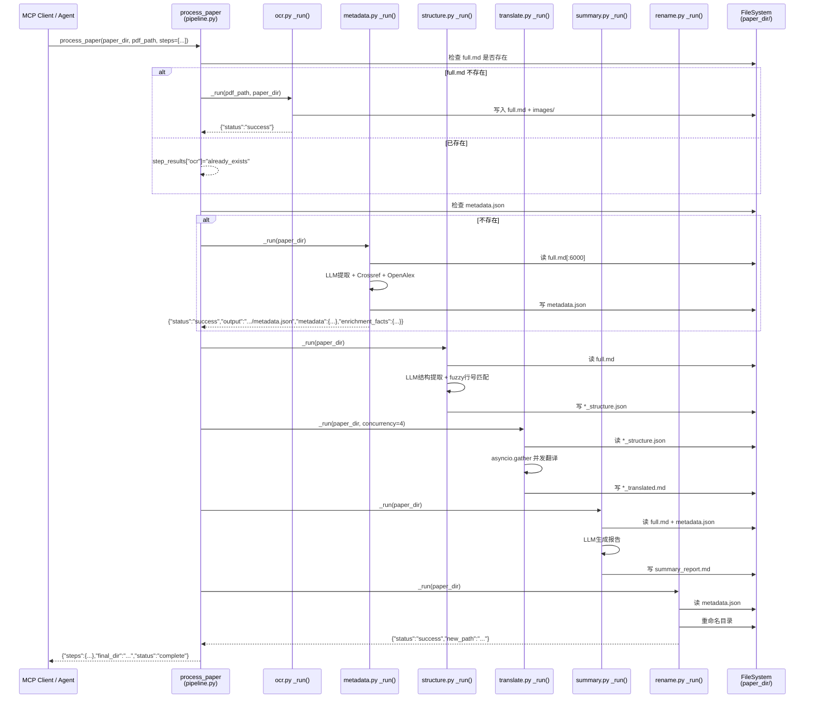
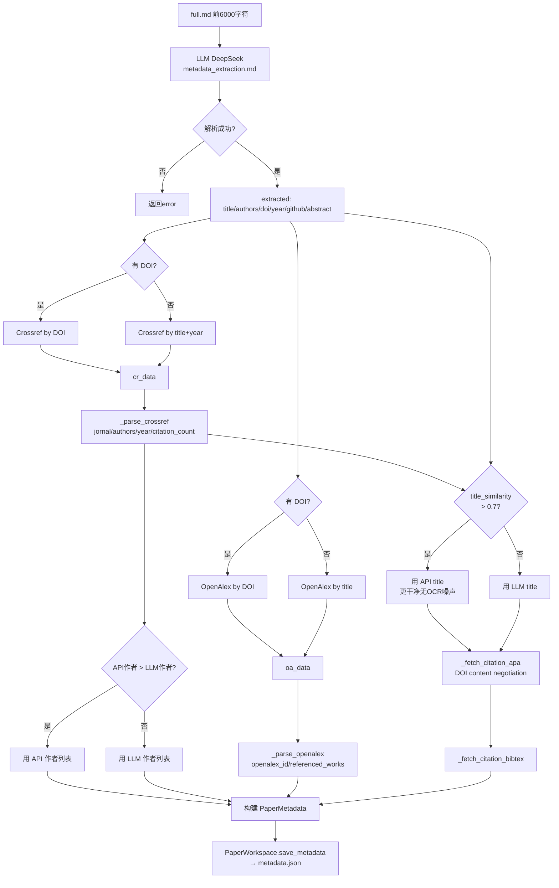
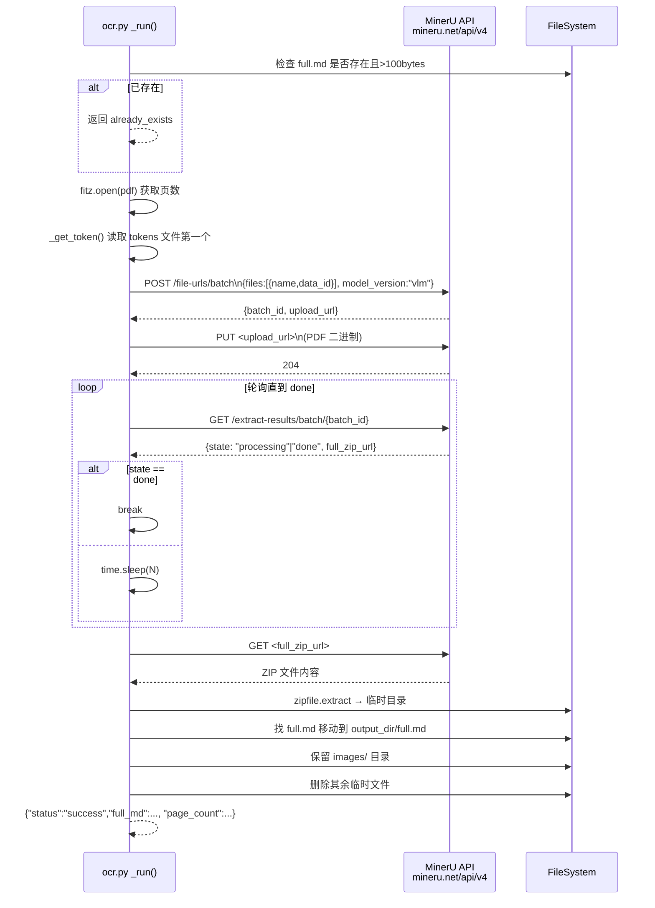
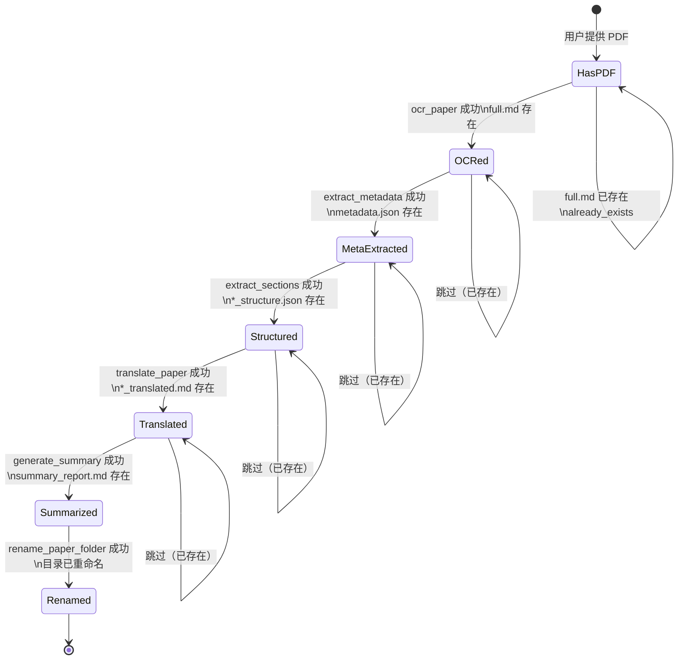
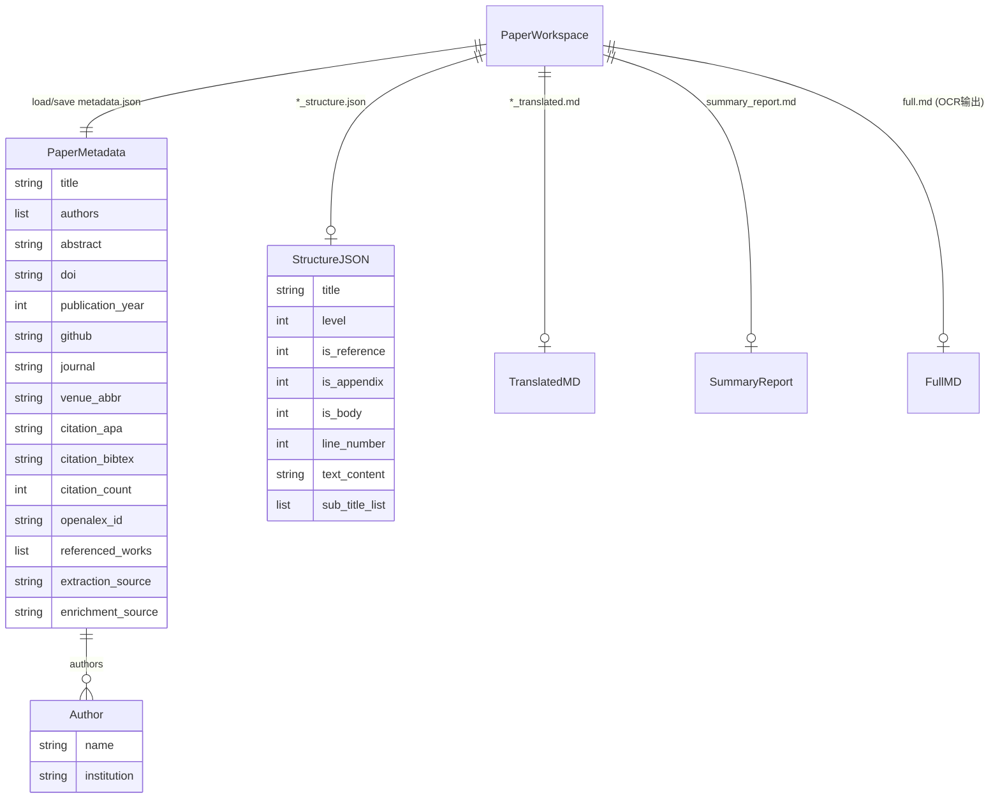

# fro-wang-academic-tools-mcp — System README

> **面向受众：** 接手项目的新开发者 / 编排 Agent / 排障工程师。  
> **读法：** 先读 §1 TL;DR，再按需跳转各节。所有"事实"在句末附代码定位 `(code: path#Symbol)`。  
> **Mermaid 说明：** 仓库 `navigation.md` 中的 Mermaid 图为通用任务调度示例，与本项目流程不符，故以下所有图均为新建；每幅图头注明对应流程/模块。

---

## Table of Contents

- [1. TL;DR（一页读懂）](#1-tldr一页读懂)
- [2. Quick Start（本地跑起来）](#2-quick-start本地跑起来)
- [3. System Overview（全景图）](#3-system-overview全景图)
- [4. Entry Points（所有入口点）](#4-entry-points所有入口点)
- [5. Core Flows（最重要的流程）](#5-core-flows最重要的流程)
  - [Flow A: 单 PDF → 全流程（process_paper）](#flow-a-单-pdf--全流程process_paper)
  - [Flow B: Metadata 提取与富化](#flow-b-metadata-提取与富化)
  - [Flow C: OCR（MinerU API）](#flow-c-ocrmineru-api)
- [6. Core Modules（模块黄页）](#6-core-modules模块黄页)
- [7. State / File Layout / Scheduling（状态与调度）](#7-state--file-layout--scheduling状态与调度)
- [8. Data Model & Consistency（数据与一致性）](#8-data-model--consistency数据与一致性)
- [9. Observability & Troubleshooting（观测与排障）](#9-observability--troubleshooting观测与排障)
- [10. Reuse Guide（避免重复造轮子）](#10-reuse-guide避免重复造轮子)
- [11. Appendix（术语、待办、链接）](#11-appendix术语待办链接)

---

## 1. TL;DR（一页读懂）

**fro-wang-academic-tools-mcp** 是一个**统一学术论文处理 MCP Server**，通过
[FastMCP](https://github.com/jlowin/fastmcp) 以 stdio 协议暴露 **19 个工具**，
供 Claude Desktop / Cursor / 任意 MCP-compatible Agent 直接调用。

**主能力链路（最短叙述）：**

```
PDF  →[ocr_paper]→  full.md
                 →[extract_metadata]→  metadata.json  （LLM + Crossref + OpenAlex）
                 →[extract_sections]→  *_structure.json
                 →[translate_paper]→   *_translated.md （并发翻译）
                 →[generate_summary]→  summary_report.md
                 →[rename_paper_folder]→ 目录按 Authors-Venue-Year-Title 规范重命名
```

或者：一次调用 `process_paper` 完成所有步骤，支持断点续跑。

配套能力：**arXiv 搜索/下载**、**Zotero 文库管理**（10 个工具）。

### 三条最关键不变量

| 编号 | 不变量 | 机制 |
|------|--------|------|
| I-1 | **幂等**：已完成的步骤不重复执行 | OCR 检查 `full.md` 是否 > 100 bytes；pipeline 检查各输出文件是否存在 `(code: tools/ocr.py#_run)` `(code: tools/pipeline.py#process_paper)` |
| I-2 | **单一文件布局**：所有工具通过 `PaperWorkspace` 读写，路径命名集中管理 | `(code: models/paper.py#PaperWorkspace)` |
| I-3 | **所有步骤返回 JSON 字符串**：`{"status": "success"/"error"/"already_exists"/"dry_run", ...}`，上层（pipeline / Agent）依此判断是否继续 | `(code: tools/pipeline.py#run_step)` |

---

## 2. Quick Start（本地跑起来）

### 2.1 前置依赖

| 依赖 | 说明 |
|------|------|
| Python ≥ 3.11 | 项目 `requires-python = ">=3.11"` |
| MinerU 账号 | OCR 需要 [mineru.net](https://mineru.net) API Token |
| DeepSeek API Key | 或其他 OpenAI-compatible endpoint |
| Zotero（可选） | 远程模式需 Library ID + API Key；本地模式设 `ZOTERO_LOCAL=true` |

### 2.2 安装

```bash
# 使用全局 venv（项目约定）
F:/global_venv/.venv/Scripts/python.exe -m pip install -e \
  "f:/codeF/llm_projects/academic_tools_for_agents/mcps/fro-wang-academic-tools-mcp"

# 或标准安装
pip install -e "path/to/fro-wang-academic-tools-mcp"
```

### 2.3 配置

```bash
cd mcps/fro-wang-academic-tools-mcp
cp .env.example .env
# 编辑 .env，至少填写：
#   LLM_API_KEY=sk-...
#   ZOTERO_LIBRARY_ID=...
#   ZOTERO_API_KEY=...
#   MINERU_TOKENS_FILE=~/.fro-wang-academic-tools-mcp/mineru_tokens.txt
```

**所有配置项**（`code: src/academic_tools/config.py#Settings`）：

| 环境变量 | 默认值 | 说明 |
|----------|--------|------|
| `LLM_API_KEY` | — | LLM API Key |
| `LLM_BASE_URL` | `https://api.deepseek.com` | OpenAI-compatible endpoint |
| `LLM_MODEL` | `deepseek-chat` | 使用的模型名 |
| `ZOTERO_LIBRARY_ID` | — | Zotero 用户/群组 ID |
| `ZOTERO_LIBRARY_TYPE` | `user` | `user` 或 `group` |
| `ZOTERO_API_KEY` | — | Zotero Web API Key |
| `ZOTERO_LOCAL` | `false` | 本地模式（Zotero 桌面端必须运行） |
| `ARXIV_STORAGE_PATH` | `papers` | arXiv 下载目录（建议使用绝对路径；相对路径按当前工作目录解析） |
| `MINERU_API_BASE` | `https://mineru.net/api/v4` | MinerU API 基地址 |
| `MINERU_TOKENS_FILE` | — | 一行一个 token 的文本文件路径 |
| `METADATA_TEXT_LIMIT` | `6000` | 发给 LLM 提取元数据的字符数上限 |

### 2.4 启动服务

```bash
# 方式 1：命令行脚本（安装后可用）
fro-wang-academic-tools-mcp

# 方式 2：模块调用
python -m academic_tools
```

服务以 **stdio 传输**启动，监听 stdin/stdout MCP JSON-RPC 消息。

### 2.5 最小可验证链路（arXiv 搜索）

在 MCP Client（如 Claude Desktop）中调用：

```json
{
  "tool": "search_papers",
  "arguments": {
    "query": "large language model voting",
    "max_results": 3
  }
}
```

预期输出：JSON 数组，每项包含 `id、title、authors、abstract、pdf_url`。  
`(code: tools/arxiv.py#_raw_search)`

### 2.6 常见坑

| 坑 | 原因 | 解决 |
|----|------|------|
| `MINERU_TOKENS_FILE not set` | `.env` 未配置 | 设 `MINERU_TOKENS_FILE` 指向实际文件 |
| OCR 超时 | MinerU 免费额度轮询慢 | 增加重试间隔，默认轮询在 `tools/ocr.py#_poll_result` |
| LLM 返回非 JSON | DeepSeek/模型变格式 | `shared/prompt_utils.py#extract_json_from_response` 有 5 层兜底，仍失败则检查 prompt |
| Zotero `Missing credentials` | 未配置远程/本地 | 远程需 `ZOTERO_LIBRARY_ID + ZOTERO_API_KEY`；本地设 `ZOTERO_LOCAL=true` |

---

## 3. System Overview（全景图）

> **新图原因：** `navigation.md` 中的 Mermaid 为通用任务分发系统模板，与本项目结构不符。以下模块地图基于实际代码结构生成。

### 3.1 模块分层 Mindmap



### 3.2 各层说明

| 层 | 职责 | 关键文件 |
|----|------|----------|
| **入口层** | 启动 MCP 服务，注册所有工具 | `server.py`, `__main__.py` |
| **工具层** | 每个 `.py` 暴露一个 `register(mcp)` 函数，注册 MCP 工具；每个工具都有模块级 `_run()` 供 pipeline 导入 | `tools/*.py` |
| **编排层** | `pipeline.py` 串联所有步骤，直接 import 各工具的 `_run()` | `tools/pipeline.py` |
| **基础设施层** | 配置单例、LLM 客户端单例、Prompt 加载、工具函数；不含业务逻辑 | `config.py`, `shared/`, `models/` |
| **外部连接层** | Zotero pyzotero 包装、Prompt 模板文件 | `zotero/`, `prompts/` |

### 3.3 依赖方向



---

## 4. Entry Points（所有入口点）

本项目只有 **一类入口**：MCP stdio 协议工具调用。没有 HTTP 路由、cron、队列 consumer。

### 4.1 启动入口

| 入口 | 代码路径 | 说明 |
|------|----------|------|
| CLI 命令 `fro-wang-academic-tools-mcp` | `src/academic_tools/__main__.py#main()` | `pyproject.toml` 中 `[project.scripts]` 定义 |
| `python -m academic_tools` | `src/academic_tools/__main__.py` | 等价入口 |
| 启动链 | `main()` → `mcp.run()` → `server.py#mcp`(FastMCP) | `(code: __main__.py#main)` |

### 4.2 工具清单（全部 19 个 MCP 工具）

#### 论文处理工具（8 个，单步）

| 工具名 | 触发文件 | 关键参数 | 输出产物 |
|--------|----------|----------|----------|
| `ocr_paper` | `tools/ocr.py` | `pdf_path`, `output_dir` | `full.md` + `images/` |
| `extract_metadata` | `tools/metadata.py` | `paper_dir` | `metadata.json` |
| `extract_sections` | `tools/structure.py` | `paper_dir` | `<stem>_structure.json` |
| `translate_paper` | `tools/translate.py` | `paper_dir`, `concurrency=4` | `<stem>_translated.md` |
| `generate_summary` | `tools/summary.py` | `paper_dir` | `summary_report.md` |
| `rename_paper_folder` | `tools/rename.py` | `paper_dir`, `dry_run=False` | 目录重命名 |

#### 编排工具（1 个）

| 工具名 | 触发文件 | 关键参数 |
|--------|----------|----------|
| `process_paper` | `tools/pipeline.py` | `paper_dir`, `pdf_path`, `steps`, `skip_completed`, `translate_concurrency`, `dry_run_rename` |

#### arXiv 工具（2 个）

| 工具名 | 触发文件 | 关键参数 |
|--------|----------|----------|
| `search_papers` | `tools/arxiv.py` | `query`, `max_results`, `date_from`, `date_to`, `categories`, `sort_by` |
| `download_paper` | `tools/arxiv.py` | `paper_id`, `download_dir` |

#### Zotero 工具（10 个）

| 工具名 | 触发文件 | 说明 |
|--------|----------|------|
| `zotero_search_items` | `tools/zotero.py` | 关键词搜索 |
| `zotero_get_item_metadata` | `tools/zotero.py` | 按 key 查元数据 |
| `zotero_get_item_fulltext` | `tools/zotero.py` | 获取全文（markitdown 转换） |
| `zotero_get_collections` | `tools/zotero.py` | 列出所有分组 |
| `zotero_get_collection_items` | `tools/zotero.py` | 分组内条目 |
| `zotero_get_tags` | `tools/zotero.py` | 所有标签 |
| `zotero_get_recent` | `tools/zotero.py` | 最近添加条目 |
| `zotero_get_annotations` | `tools/zotero.py` | PDF 批注（Better BibTeX） |
| `zotero_get_notes` | `tools/zotero.py` | 条目笔记 |
| `zotero_create_note` | `tools/zotero.py` | 创建笔记 |

---

## 5. Core Flows（最重要的流程）

### Flow A: 单 PDF → 全流程（process_paper）

> **新图原因：** 这是本项目核心编排流程，`navigation.md` 中无对应图。

#### 步骤

```
1. ocr_paper(pdf_path, paper_dir)
   - 上传 PDF → MinerU API → 轮询结果 → 下载 ZIP → 解压 → 保留 full.md + images/
   - 幂等点：full.md 已存在且 > 100 bytes → 直接跳过

2. extract_metadata(paper_dir)
   - 读取 full.md 前 6000 字符 → LLM 提取 title/authors/abstract/doi/year/github
   - Crossref 查 DOI 或标题 → 获得 journal/citation_count/APA/BibTex
   - OpenAlex 查 DOI 或标题 → 获得 openalex_id/referenced_works
   - 标题交叉验证（相似度 > 0.7 → 用 API 标题）
   - 写入 metadata.json
   - 返回统一状态包：`{"status":"success","output":".../metadata.json","metadata":{...},"enrichment_facts":{...}}`
   - 幂等点：metadata.json 已存在 → 跳过（skip_completed=True 时）

3. extract_sections(paper_dir)
   - 读取全文 full.md → LLM section_extraction.md prompt → 结构 JSON
   - fuzzy 匹配各节标题对应行号 → 注入 text_content
   - 写入 <stem>_structure.json

4. translate_paper(paper_dir, concurrency=4)
   - 读 *_structure.json → asyncio.gather 并发翻译正文节
   - 跳过 is_reference=1 或 is_appendix=1 的节
   - 写入 <stem>_translated.md

5. generate_summary(paper_dir)
   - 读 full.md + metadata.json → Fill summary_report.md prompt
   - LLM 生成 6 节深读报告（plain text）
   - 写入 summary_report.md

6. rename_paper_folder(paper_dir)
   - 读 metadata.json → format_authors + abbreviate_venue + year + title_first_words
   - 拼装 "Authors-Venue-Year-Title" → 冲突则追加 -v2/-v3
   - 重命名目录；更新 current_dir → 后续步骤感知新路径
```

#### 时序图



#### 幂等 / 重试 / 失败收敛

| 场景 | 机制 | 代码位置 |
|------|------|----------|
| 步骤产物已存在 | `skip_completed=True` 检查文件存在性跳过 | `tools/pipeline.py#process_paper` |
| OCR 已完成 | `full.md` 大小 > 100 bytes → 直接返回 `already_exists` | `tools/ocr.py#_run` |
| 目录名冲突 | `_resolve_collision()` 追加 `-v2/-v3` 直到空闲 | `tools/rename.py#_resolve_collision` |
| OCR 失败 | **中止 pipeline**，返回 `{"error":"OCR failed, aborting"}` | `tools/pipeline.py#process_paper` |
| Metadata 失败 | **中止 pipeline** | `tools/pipeline.py#process_paper` |
| Structure/Translate/Summary 失败 | 记录错误但**继续执行**后续步骤（非阻断） | `tools/pipeline.py#run_step` |
| Enrichment API failure | **Segmented degrade**: Crossref/OpenAlex/Citation are isolated; return `enrichment_facts` (with `enrichment_status`) for callers | `tools/metadata.py#_run` |.
| MinerU 轮询 | `_poll_result()` 循环等待，TODO: 未见超时上限设置 | `tools/ocr.py#_poll_result` |

---

### Flow B: Metadata 提取与富化

> **新图原因：** 这是本项目最复杂的数据处理流程，需独立解释。

#### 步骤

```
1. 读取 full.md 前 METADATA_TEXT_LIMIT（默认 6000）字符
2. LLM 调用（DeepSeek）→ JSON：title, authors, abstract, doi, year, github
   提示规则：跳过 Proceedings 等会议名，识别第一个 # 标题为论文标题
3. DOI 优先查 Crossref；无 DOI 则用 title 查
4. DOI 优先查 OpenAlex；无 DOI 则用 title 查
5. 标题交叉验证：_title_similarity(llm_title, api_title) > 0.7 → 用 API 标题
   （解决 OCR 会把会议名误作标题的问题）
6. 若 API 作者 > LLM 作者数量 → 用 API 作者列表补齐
7. DOI content negotiation → APA 引用 + BibTeX
8. 构建 PaperMetadata 写入 metadata.json
```

#### 流程图



---

### Flow C: OCR（MinerU API）

> **新图原因：** MinerU API 是异步轮询式，流程不直观。



---

## 6. Core Modules（模块黄页）

### M1. `config.py` — 配置单例

- **负责什么：** 从 `.env` 读取所有配置，暴露全局单例 `settings`
- **对外接口：** `settings: Settings` 全局对象（`code: config.py#settings`）
- **关键字段：** `LLM_API_KEY`, `LLM_BASE_URL`, `LLM_MODEL`, `ZOTERO_*`, `MINERU_*`, `METADATA_TEXT_LIMIT`
- **依赖：** pydantic-settings；工具层所有模块直接 import
- **不负责：** 运行时配置热更新；需要修改配置必须重启进程
- **代码入口：** `src/academic_tools/config.py#Settings`

---

### M2. `models/paper.py` — PaperWorkspace（文件布局管理）

- **负责什么：** 管理一篇论文目录下的标准文件命名，集中化路径逻辑
- **对外接口：**
  - `PaperWorkspace(paper_dir)` 构造
  - `.ocr_markdown` → `full.md` 路径
  - `.metadata_path` → `metadata.json` 路径
  - `.structure_path` → `<stem>_structure.json` 路径
  - `.translated_path` → `<stem>_translated.md` 路径
  - `.summary_path` → `summary_report.md` 路径
  - `.status() → dict` 各步骤完成情况
  - `.require_ocr()` / `.require_metadata()` / `.require_structure()` — 文件不存在则抛 `FileNotFoundError`
  - `.save_metadata(meta: PaperMetadata)` / `.load_metadata()`
- **关键状态：** 无内存状态；所有状态在磁盘文件
- **依赖：** `models/metadata.py`
- **不负责：** 文件创建（由各工具负责）；路径以外的任何业务逻辑
- **代码入口：** `src/academic_tools/models/paper.py#PaperWorkspace`

---

### M3. `models/metadata.py` — PaperMetadata（统一元数据模型）

- **负责什么：** 论文全量元数据的 Pydantic 数据模型，合并了原 `basic_meta_data.json` 和 `scholar_metadata.json` 两个来源
- **对外接口：** `PaperMetadata`、`Author` Pydantic 模型
- **关键字段分两阶段：**

  | 阶段 | 字段 | 来源 |
  |------|------|------|
  | Phase 1（LLM） | `title`, `authors`, `abstract`, `doi`, `publication_year`, `github` | DeepSeek |
  | Phase 2（API） | `journal`, `venue_abbr`, `citation_apa`, `citation_bibtex`, `citation_count`, `openalex_id`, `referenced_works` | Crossref + OpenAlex |
  | 溯源 | `extraction_source`, `enrichment_source` | 自动填写 |

- **代码入口：** `src/academic_tools/models/metadata.py#PaperMetadata`

---

### M4. `shared/llm_client.py` — LLM 客户端单例

- **负责什么：** 统一管理对 LLM API 的调用；屏蔽 OpenAI SDK 的细节
- **对外接口：**
  - `get_llm_client() → LLMClient` 懒初始化单例
  - `LLMClient.get_json(user, ...)` → `Any` (JSON 对象)
  - `LLMClient.get_model(user, response_model, ...)` → Pydantic model
  - `LLMClient.translate(user, ...)` → `str` (纯文本)
- **依赖：** `openai.AsyncOpenAI`, `config.settings`, `prompt_utils.extract_json_from_response`
- **不负责：** Prompt 构造（由调用方构造 user 字符串）；重试（当前无自动重试）
- **代码入口：** `src/academic_tools/shared/llm_client.py#LLMClient`

---

### M5. `shared/prompt_utils.py` — Prompt 工具

- **负责什么：** 从 `prompts/` 目录加载 Markdown prompt 模板；填充 `{{key}}` 占位符；从 LLM 响应中健壮提取 JSON
- **对外接口：**
  - `load_prompt(name: str) → str` — 按文件名加载
  - `fill_prompt(template, **kwargs) → str` — 替换 `{{key}}`
  - `extract_json_from_response(response) → str` — 5 层兜底提取逻辑
- **代码入口：** `src/academic_tools/shared/prompt_utils.py`

---

### M6. `shared/utils.py` — 文本工具函数

- **负责什么：** 作者名格式化、学术场所缩写、标题截取、文件名安全化、DOI 规范化
- **关键函数：**
  - `format_authors(authors)` → `"Smith et al"` / `"Smith and Jones"` / `"Smith"`
  - `abbreviate_venue(venue)` → `"NeurIPS"` / `"ICLR"` 等
  - `title_first_words(title, limit=5)` → 用于目录命名
  - `sanitize_for_filename(text)` → Windows 安全文件名
  - `normalize_doi(doi)` → 去除 `https://doi.org/` 前缀
- **代码入口：** `src/academic_tools/shared/utils.py`

---

### M7. `tools/ocr.py` — MinerU OCR 工具

- **负责什么：** 调用 MinerU API 对 PDF 进行 OCR，输出 `full.md` + `images/`
- **关键函数：**
  - `_load_tokens()` — 从文件加载 token 列表
  - `_upload_pdf()` — POST 上传获取 batch_id
  - `_poll_result()` — 轮询 GET 直到 state=done，返回 zip URL
  - `_download_and_extract()` — 下载 ZIP，解压保留有效文件
  - `_run(pdf_path, output_dir)` — 模块级完整流程（pipeline 调用此函数）
- **幂等：** `full.md` 存在且 > 100 bytes → `already_exists`
- **代码入口：** `src/academic_tools/tools/ocr.py`

---

### M8. `tools/metadata.py` — 元数据提取与富化

- **负责什么：** LLM 提取 + Crossref/OpenAlex 富化，写 `metadata.json`
- **关键函数：**
  - `_llm_extract(text)` — DeepSeek 提取结构化字段
  - `_crossref_by_doi/title()` — Crossref API
  - `_openalex_by_doi/title()` — OpenAlex API
  - `_fetch_citation_apa/bibtex()` — DOI content negotiation
  - `_enrich(extracted)` — 合并两路结果为 `PaperMetadata`
  - `_title_similarity(a, b)` — 字符集重叠比率（阈值 0.7）
  - `_run(paper_dir)` — 模块级入口
- **Degrade strategy:** Crossref/OpenAlex/Citation are handled independently without aborting the flow; return `enrichment_facts` (`enrichment_status`, `degraded`, and per-stage status/error).
- **外部依赖：** 纯 stdlib `urllib`（无第三方 HTTP 库）
- **代码入口：** `src/academic_tools/tools/metadata.py`

---

### M9. `tools/structure.py` — 章节结构提取

- **负责什么：** LLM 识别论文章节层次 → fuzzy 匹配行号 → 注入正文内容
- **关键函数：**
  - `_find_title_line(title, md_lines, start, end)` — difflib fuzzy 匹配（MD 标题阈值 0.8，纯文本阈值 0.7）
  - `_attach_line_numbers(structure, md_lines)` — 逐节匹配行号
  - `_add_text_content(sections, md_lines)` — 按行号范围切出正文
  - `_run(paper_dir)` — 模块级入口
- **代码入口：** `src/academic_tools/tools/structure.py`

---

### M10. `tools/translate.py` — 并发翻译

- **负责什么：** 读结构 JSON，并发翻译正文节为中文，跳过参考文献/附录
- **关键逻辑：**
  - `_should_translate(section)` → `is_reference==1 or is_appendix==1` → False
  - `asyncio.Semaphore(concurrency)` 控制并发量
  - `_build_markdown(sections, translated_texts)` — 拼装最终 Markdown
- **代码入口：** `src/academic_tools/tools/translate.py`

---

### M11. `tools/summary.py` — 摘要报告

- **负责什么：** 读 `full.md + metadata.json` → LLM 生成 6 节深读报告 → `summary_report.md`
- **Prompt：** `prompts/summary_report.md`，占位符 `{{metadata}}` 和 `{{document}}`
- **代码入口：** `src/academic_tools/tools/summary.py`

---

### M12. `tools/rename.py` — 目录重命名

- **负责什么：** 从 `metadata.json` 读取字段，构建标准目录名，执行重命名
- **命名规则：** `{Authors}-{VenueAbbr}-{Year}-{TitleWords}`，利用 `shared/utils.py` 函数
- **冲突处理：** `_resolve_collision()` → `-v2`/`-v3` 后缀，最多 99 个
- **代码入口：** `src/academic_tools/tools/rename.py`

---

### M13. `tools/pipeline.py` — 流水线编排

- **负责什么：** 串联所有 6 步，直接 import 各工具 `_run()` 函数
- **关键机制：**
  - `run_step(name, coro)` 包装器：执行、解析 JSON、记录状态
  - `skip_completed=True`：在调用 `_run()` 前检查产物文件存在性
  - rename 步骤执行后更新 `current_dir`（因目录名变了）
  - OCR / Metadata 失败 → 立即 abort；其余步骤失败 → 继续执行
- **代码入口：** `src/academic_tools/tools/pipeline.py`

---

### M14. `zotero/` — Zotero 连接层

- **负责什么：** pyzotero 包装，仅保留基础 CRUD（已剥离 chromadb 语义搜索）
- **关键模块：**
  - `client.py#get_zotero_client()` — 本地/远程两种模式的客户端工厂
  - `client.py#format_item_metadata()` — 统一格式化 Zotero 条目
  - `client.py#convert_to_markdown()` — 附件 PDF 转 Markdown（markitdown）
  - `bibtex_client.py#ZoteroBetterBibTexAPI` — Better BibTeX 插件接口（批注导出）
  - `utils.py#format_creators()` — 作者字段格式化
- **不负责：** 向量搜索、语义相似度（已在架构设计时明确剔除）

---

## 7. State / File Layout / Scheduling（状态与调度）

### 7.1 论文处理状态机

本项目的"状态"完全体现在磁盘文件的存在性上（无数据库，无消息队列）。



### 7.2 状态检查

`PaperWorkspace.status()` 返回所有阶段完成情况（`code: models/paper.py#status`）：

```python
{
    "paper_dir": "/path/to/paper",
    "ocr": True/False,       # full.md 存在
    "metadata": True/False,   # metadata.json 存在
    "structure": True/False,  # *_structure.json 存在
    "translated": True/False, # *_translated.md 存在
    "summary": True/False     # summary_report.md 存在
}
```

### 7.3 并发调度策略

| 步骤 | 调度方式 |
|------|----------|
| OCR | 单个 HTTP 请求 + 轮询，无并发 |
| Metadata | LLM 提取（串行）+ Crossref/OpenAlex（串行，stdlib urllib） |
| Structure | 单次 LLM 调用，串行 |
| Translate | `asyncio.Semaphore(concurrency=4)` 控制并发 LLM 调用 |
| Summary | 单次 LLM 调用，串行 |
| Pipeline 各步骤 | 串行执行（步骤间有数据依赖） |

---

## 8. Data Model & Consistency（数据与一致性）

### 8.1 核心数据结构



### 8.2 一致性策略

| 场景 | 策略 |
|------|------|
| `metadata.json` 的原子写入 | `Path.write_text()` 单次调用（OS 层不保证原子，但文件较小，实践中风险极低） |
| 部分步骤失败 | 已完成步骤的产物文件**保留在磁盘**；重跑 pipeline 时 `skip_completed=True` 自动从断点继续 |
| Enrichment API 失败 | 降级为 LLM-only 结果写入，字段缺失但不丢失已提取数据 |
| 目录重命名中断 | `Path.rename()` 是 OS 层原子操作（同文件系统内）；跨盘移动非原子 |
| 无数据库事务 | 本项目完全基于文件系统，无分布式一致性问题 |

---

## 9. Observability & Troubleshooting（观测与排障）

**当前版本**：日志通过 Python `logging` 模块输出到 stderr（FastMCP stdio 模式下，stderr 流向 MCP Client 日志）。无结构化 metrics、无 trace。以下是人工排障策略。

### 9.1 故障排查手册

#### 故障 1：OCR 无响应 / 超时

**症状：** `process_paper` 长时间无返回，或 OCR 步骤卡住。

**定位路径：**
1. 检查 `MINERU_TOKENS_FILE` 中的 token 是否有效（curl 直接调 MinerU API 验证）
2. 查看 `_poll_result()` 轮询逻辑：`(code: tools/ocr.py#_poll_result)`
   - TODO(verify): 轮询间隔和最大次数需在代码中确认，当前未见超时上限
3. 手动检查 `paper_dir/full.md` 是否已存在（如存在则 OCR 不会重跑）

#### 故障 2：元数据标题提取错误（提取到了会议名）

**症状：** `metadata.json` 的 `title` 字段是 "Proceedings of XXX" 而非论文标题。

**定位路径：**
1. 检查 `prompts/metadata_extraction.md`：已有明确规则禁止这种情况
2. 检查 LLM 响应：`_llm_extract()` 调用 `temperature=0.0`（确定性输出）
3. 查看交叉验证：`_title_similarity()` 阈值 0.7，检查 Crossref 是否返回正确标题
   - `(code: tools/metadata.py#_enrich_with_facts)`.
4. 临时解决：手动编辑 `metadata.json`，重跑 `rename_paper_folder`

#### 故障 3：metadata.json 字段为空（无 journal/citation）

**症状：** `metadata.json` 只有 LLM 提取字段，Phase 2 字段全 null。

**定位路径：**
1. 检查 DOI 是否被正确提取：`metadata.json#doi`
2. Crossref 查询：`_crossref_by_doi(doi)` 直接用 `curl https://api.crossref.org/works/<doi>` 测试
3. 如果无 DOI，检查 `_crossref_by_title()` 是否有 Crossref 速率限制（429）
4. Check `enrichment_facts`: focus on `enrichment_status` (`success/degraded/no_data/failed`) and each stage `crossref/openalex/citation` `status/error`.
   - `(code: tools/metadata.py#_run)`.

#### 故障 4：翻译步骤报错 / 部分节未翻译

**症状：** `*_translated.md` 中有 `[翻译失败: ...]` 标记。

**定位路径：**
1. 检查 `LLM_API_KEY` 有效性和账户余额
2. 检查并发度 `translate_concurrency`（默认 4），过高可能触发 rate limit
3. 查看 `should_translate()` 逻辑：`is_reference=1` 或 `is_appendix=1` 的节不翻译
   - `(code: tools/translate.py#_should_translate)`

#### 故障 5：目录重命名失败 / 名称格式异常

**症状：** `rename_paper_folder` 返回 `unchanged` 或目录名缺少某字段。

**定位路径：**
1. 检查 `metadata.json` 是否有 `title`, `authors`, `publication_year`, `journal`
2. `venue_abbr` 字段优先于 `journal`，若两者都空则显示 `UNKNOWN`
3. 检查 `_build_folder_name()` 中各 `sanitize_for_filename()` 是否把有效字符去掉了
   - `(code: tools/rename.py#_build_folder_name)`

#### 故障 6：Zotero 工具报 `Missing credentials`

**定位路径：**
1. 检查 `.env` 中是否设置 `ZOTERO_LIBRARY_ID + ZOTERO_API_KEY`
2. 本地模式：设 `ZOTERO_LOCAL=true`，确保 Zotero 桌面应用正在运行
3. `(code: zotero/client.py#get_zotero_client)`

#### 故障 7：结构提取返回非 list

**症状：** `extract_sections` 返回 `{"status":"error","error":"LLM returned unexpected format (expected list)"}`

**定位路径：**
1. 检查 `prompts/section_extraction.md` prompt 是否完整
2. 检查 `extract_json_from_response()` 是否成功提取 JSON
3. 增大上下文窗口：当前发送 `full.md` 全文，若模型上下文不足会截断

---

## 10. Reuse Guide（避免重复造轮子）

### 已实现可直接复用的能力

| 能力 | 模块 | 最短调用示例 |
|------|------|-------------|
| **LLM 调用（带 JSON 解析）** | `shared/llm_client.py` | `client = get_llm_client(); result = await client.get_json(user=prompt)` |
| **LLM 纯文本输出** | `shared/llm_client.py` | `text = await client.translate(user=prompt)` |
| **Prompt 加载 + 填充** | `shared/prompt_utils.py` | `tp = load_prompt("translation.md"); p = fill_prompt(tp, document=text)` |
| **JSON 从 LLM 响应提取**（5层兜底） | `shared/prompt_utils.py` | `json_str = extract_json_from_response(raw_response)` |
| **作者名格式化** | `shared/utils.py` | `format_authors([{"name": "John Smith"}, ...])` → `"Smith"` |
| **学术场所缩写** | `shared/utils.py` | `abbreviate_venue("Neural Information Processing Systems")` → `"NeurIPS"` |
| **DOI 规范化** | `shared/utils.py` | `normalize_doi("https://doi.org/10.1145/...")` → `"10.1145/..."` |
| **文件名安全化** | `shared/utils.py` | `sanitize_for_filename("A/B: C?")` → `"A B C"` |
| **论文目录状态检查** | `models/paper.py` | `ws = PaperWorkspace(d); ws.status()` → 各步骤布尔值字典 |
| **元数据读写** | `models/paper.py` | `meta = ws.load_metadata(); ws.save_metadata(meta)` |
| **Crossref 查询**（纯 stdlib） | `tools/metadata.py` | `_crossref_by_doi(doi)` 或 `_crossref_by_title(title, year)` |
| **OpenAlex 查询**（纯 stdlib） | `tools/metadata.py` | `_openalex_by_doi(doi)` 或 `_openalex_by_title(title)` |
| **Zotero 客户端** | `zotero/client.py` | `zot = get_zotero_client()` 然后调用 pyzotero API |

### 常见误用警告

| 误用 | 正确做法 |
|------|----------|
| 在工具代码中直接 `import os; os.getenv("LLM_API_KEY")` | 始终使用 `from ..config import settings` |
| 自己拼 `paper_dir + "/full.md"` | 使用 `PaperWorkspace(paper_dir).ocr_markdown` |
| 每个工具模块各自实例化 `AsyncOpenAI(...)` | 使用 `get_llm_client()` 单例 |
| 在工具中直接定义 MCP tool 函数内写完整业务逻辑 | 提取为 `_run()` 模块级函数，`register()` 只做包装（供 pipeline 复用） |
| 在 `register()` 外访问 `mcp` 实例 | 每个 tool 模块只在 `register(mcp)` 内部使用 `mcp.tool()` 装饰器 |
| 手动加载 prompt 文件路径 | 使用 `load_prompt("filename.md")` ，它自动解析相对 `prompts/` 目录 |
| 翻译步骤串行调用 LLM | 使用 `asyncio.gather` + `asyncio.Semaphore`，参见 `tools/translate.py#_run` |

---

## 11. Appendix（术语、链接、待办）

### 术语表

| 术语 | 含义 |
|------|------|
| `paper_dir` | 论文工作目录，如 `~/papers/Smith-NeurIPS-2024-LLM-Voting/` |
| `full.md` | MinerU OCR 输出的完整 Markdown 文本 |
| `stem` | 论文目录的名称，如 `Smith-NeurIPS-2024-LLM-Voting` |
| `metadata.json` | 统一元数据文件（Pydantic PaperMetadata 序列化） |
| `_run()` | 每个工具模块的模块级入口函数，供 pipeline 直接 import |
| `register(mcp)` | 每个工具模块暴露给 server.py 的注册函数 |
| OCR | MinerU API 对 PDF 进行高质量 Markdown 转换 |
| Phase 1 / Phase 2 | metadata 提取的两个阶段：LLM 提取 / 学术 API 富化 |
| DOI content negotiation | 向 `https://doi.org/<doi>` 发 Accept 头获取 APA/BibTeX 引用的标准方式 |
| MCP | [Model Context Protocol](https://modelcontextprotocol.io/)，Claude/Cursor 调用外部工具的协议 |
| FastMCP | MCP 的 Python 高层封装库 |
| Better BibTeX | Zotero 插件，提供 citekey 管理和批注导出 |

### 外部 API 依赖

| API | 用途 | 认证方式 |
|-----|------|----------|
| MinerU (`mineru.net/api/v4`) | PDF OCR | Bearer Token（`MINERU_TOKENS_FILE`） |
| DeepSeek / OpenAI | LLM 调用 | API Key（`LLM_API_KEY`） |
| Crossref (`api.crossref.org`) | 元数据富化 | 无（建议加 User-Agent） |
| OpenAlex (`api.openalex.org`) | 元数据富化 | 无（polite pool 需加 mailto） |
| arXiv Atom API | 搜索 | 无 |
| Zotero Web API | 文献库管理 | API Key（`ZOTERO_API_KEY`） |

### TODO（已知待改进点）

| 编号 | 问题 | 位置 |
|------|------|------|
| T-1 | MinerU 轮询无超时上限，可能无限阻塞 | `tools/ocr.py#_poll_result` |
| T-2 | `_title_similarity()` 使用字符集重叠（非 difflib），对相似度判断较粗糙 | `tools/metadata.py#_title_similarity` |
| T-3 | Crossref/OpenAlex 请求无重试机制，网络抖动即失败 | `tools/metadata.py#_http_get` |
| T-4 | LLM 调用无重试/退避机制 | `shared/llm_client.py#_complete` |
| T-5 | `generate_summary` 发送完整 `full.md`，可能超出模型上下文限制 | `tools/summary.py#_run` |
| T-6 | MinerU token 仅使用列表第一个，无实际轮换逻辑 | `tools/ocr.py#_get_token` |
| T-7 | 无测试文件（`tests/` 目录尚未建立） | 项目根 |

### 相关文件链接

- 配置参考：`.env.example`
- 项目依赖：`pyproject.toml`
- 提示词模板：`src/academic_tools/prompts/`
- 原始 skills 代码（迁移来源）：`skills/` 目录
- 原始 Zotero MCP（迁移来源）：`mcps/zotero-mcp-main/`
- 原始 arXiv MCP（迁移来源）：`mcps/arxiv-mcp-server/`
